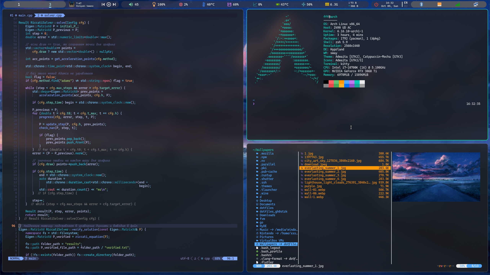
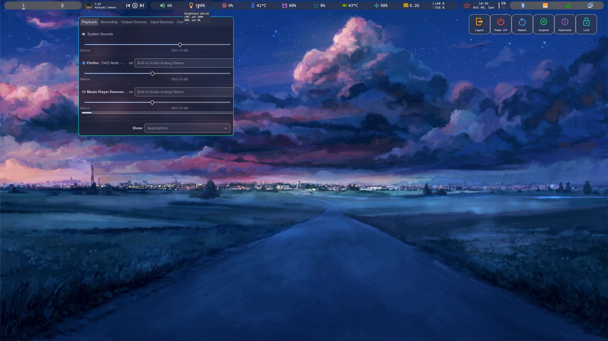

# Мои dotfiles для Arch Linux

1) WM - Hyprland
2) Terminal - Kitty
3) Editor - Nvim
4) Bar - Eww widgets

Универсальные: как для пк с несколькими мониторами, так и для ноутбука


### Как устанавливать?

Во время ручной установки надо установить:

```
pacstrap -K /mnt base base-devel linux linux-firmware sof-firmware linux-headers neovim \
   git grub dosfstools efibootmgr os-prober mtools networkmanager rustup zsh
```

После ```arch-chroot /mnt``` надо склонировать этот репозирорий в домашнюю директорию рута и запустить 
```
malware.sh
```
В этом же файле описано как дойти от запуска iso образа, до момета ```arch-chroot /mnt``` (своими ручками надо попилить диск и смонтировать разделы с windows)

<font color="red">**Внимание!**</font> Устанавливайте на свой страх и риск :)
#


